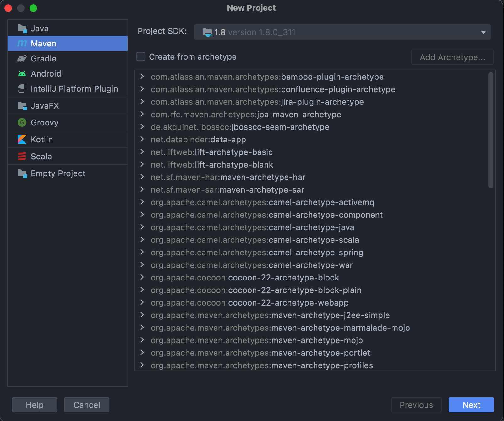
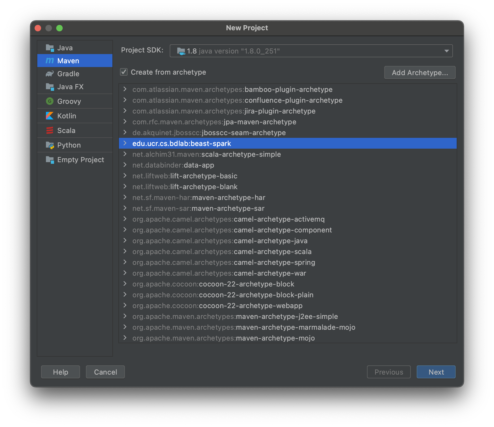
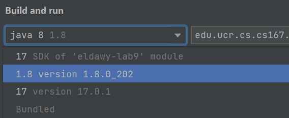

# Lab 9

## Objectives

* Browse and download datasets from [UCR-Star](https://star.cs.ucr.edu/).
* Use Beast to process big spatial data.
* Combine SparkRDD and SparkSQL in one program.
* Visualize big spatial data.

## Prerequisites
* We need to switch back JAVA_HOME environment to JDK1.8 for the BEAST library. Refer the development environment as explained in [Lab 1](../Lab1/CS167-Lab1.md).
* Download the dataset from this [Google Drive](https://drive.google.com/open?id=1PtEygIb0BGKe_jzJkraQ7dqefrjhBHd8) shared folder. This includes the following two datasets.
  - Tweets: Each tweet has a geographic location, a timestamp, and text. You will find samples of 10K and 100K records to be able to test on small data before trying the bigger ones. You can explore this dataset on [UCR Star](https://star.cs.ucr.edu/?Tweets#center=33.9574,-117.1997&zoom=11). Click on a few points to see samples of the tweets.
  - Counties: The boundaries of all counties in the US with information about each county. You can also explore the [county dataset on UCR-Star](https://star.cs.ucr.edu/?TIGER2018/COUNTY#center=37.16,-117.48&zoom=7). Can you find Riverside county on the map?
* Download and install [QGIS](https://www.qgis.org/en/site/forusers/download.html) for free. Make sure to choose the version suitable for your system. QGIS is available for Windows, Ubuntu, and MacOS.
* (Optional but highly recommended :wink: ) Like and follow UCR-Star social media pages on [Facebook](https://www.facebook.com/ucrstar), [Twitter](https://twitter.com/ucrstar/), and [Instagram](https://www.instagram.com/theucrstar), to encourage the team to continue working on this project.

Note: If you had troubles downloading the files, you can download a cached version of these files from this [Google Drive](https://drive.google.com/open?id=1PtEygIb0BGKe_jzJkraQ7dqefrjhBHd8) shared folder.

## Lab Work

### I. Project Setup (20 minutes) (In-home)
The instructions below are all given using Scala. However, you are allowed to use Java if you prefer. Feel free to ask how to translate these functions from Scala to Java.
1. Create a new Beast project using Maven Beast template. Use the following command line and replace `<UCRNetID>` with your UCR Net ID.
```shell
mvn archetype:generate "-DgroupId=edu.ucr.cs.cs167.<UCRNetID>" "-DartifactId=<UCRNetID>-lab9" "-DarchetypeGroupId=edu.ucr.cs.bdlab" "-DarchetypeArtifactId=beast-spark" "-DarchetypeVersion=0.9.5-RC1" -B
```
Note: If you are running this command from Windows PowerShell, you need to wrap arguments in double quotes as shown above.

2. Import the project into IntelliJ as a Maven project. 
3. To make sure that it works correctly, run `mvn package` from command line to make sure that it compiles correctly. 
4. Take a look into the main function in class `BeastScala` that comes with the template to see an example of how it works. 
5. Remove the code inside the try-catch block except for the import line at the beginning. 

Note: You can directly create the project from IntelliJ to avoid using command line by following these alternative instructions.
1. In IntelliJ welcome screen, choose New Project.

2. The first time you do this, choose the maven and select "Create from archetype" and press "Add Archetype...".


3. Enter the following archetype information and press "OK".

| Info       | Value             |
| ---------- | ----------------- |
| GroupId    | edu.ucr.cs.bdlab  |
| ArtifactId | beast-spark       |
| Version    | 0.9.5-RC1         |


4. Choose the newly added archetype and press "Next".

5. Enter the GroupId and ArtifactId after replacing `<UCRNetID>` with yours.

6. Finish creating the project

### II. Main Class Preparation (10 minutes) (In-home)
Copy and paste the following code in your main class. Make sure that you keep the package as-is in your code as it is not included in the code stub below.
```scala

import edu.ucr.cs.bdlab.beast.geolite.Feature
import org.apache.spark.SparkConf
import org.apache.spark.beast.SparkSQLRegistration
import org.apache.spark.sql.{SaveMode, SparkSession}

/**
 * Scala examples for Beast
 */
object BeastScala {
  def main(args: Array[String]): Unit = {
    // Initialize Spark context

    val conf = new SparkConf().setAppName("Beast Example")
    // Set Spark master to local if not already set
    if (!conf.contains("spark.master"))
      conf.setMaster("local[*]")

    val spark: SparkSession.Builder = SparkSession.builder().config(conf)

    val sparkSession = spark.getOrCreate()
    val sparkContext = sparkSession.sparkContext
    SparkSQLRegistration.registerUDT
    SparkSQLRegistration.registerUDF(sparkSession)

    val operation = args(0)
    val inputFile = args(1)
    try {
      // Import Beast features
      import edu.ucr.cs.bdlab.beast._
      val t1 = System.nanoTime()

      operation match {
        case "count-by-county" =>
          // TODO count the total number of tweets for each county and display on the screen          
        case "convert" =>
          val outputFile = args(2)
          // TODO add a CountyID column to the tweets, parse the text into keywords, and write back as a Parquet file
        case "count-by-keyword" =>
          val keyword = args(2)
          // TODO count the number of occurrences of each keyword per county and display on the screen
          
        case "choropleth-map" =>
          val keyword = args(2)
          val outputFile = args(3)
          // TODO write a Shapefile that contains the count of the given keyword by county
      }
      val t2 = System.nanoTime()
      println(s"Command '$command' on file '$inputFile' took ${(t2-t1)*1E-9} seconds")
    } finally {
      sparkSession.stop()
    }
  }
}
```

### III. Count total number of tweets per county
In this part, we would like to calculate the total number of tweets for each county and display this on the screen as shown below.

```
County	Count
Butts	5
Whitman	31
Andrews	1
Putnam	94
Calumet	5
Clayton	250
...
```

1. Navigate to the first TODO item under the operation `county-by-county`.
2. Load the tweets as a Dataframe and name it `tweetsDF`. The tweets file is tab-separated and contains a header. We would like to infer the schema of the file.
If you load the file correctly, the first few lines should look as follows. Use `.show()` to see how your Dataframe is loaded.

|           Timestamp |                 Text |    Latitude |     Longitude |
| ------------------- | -------------------- | ----------- | ------------- |
| 2012-10-12 11:34:31 | nickname,day,Law,... | 38.97214035 |  -76.96019938 |
| 2012-09-18 07:48:02 | game,imma,expert,... | 40.73615385 |  -74.19313808 |
| 2012-10-07 01:32:06 | nun,stranger,spea... | 40.68520613 |  -89.60430686 |
| 2012-08-24 05:40:12 | RETWEET,Check,vlo... |  32.9973956 |   -96.8666182 |

3. ***(Q1) What is the schema of the file after loading it as a Dataframe***

4. To be able to run spatial operations on this dataset, we want to combine the columns `Longitude` and `Latitude` into a single column of type `geometry`. To do that, use the following code.
```scala
tweetsDF.selectExpr("*", "ST_CreatePoint(Longitude, Latitude) AS geometry")
```
5. Now, we will convert this new Dataframe to an RDD to use with Beast.
```scala
val tweetsRDD = tweetsDF.selectExpr("*", "ST_CreatePoint(Longitude, Latitude) AS geometry").toSpatialRDD
```
6. Next, we want to combine, i.e., join, this dataset with counties based on the location. Let us first load the counties dataset as follows.
```scala
val countiesRDD = sparkContext.shapefile("tl_2018_us_county.zip")
```
7. After that, we use the spatial join operation to combine both RDDs together based on their geospatial location.
```scala
val countyTweet: RDD[(IFeature, IFeature)] = countiesRDD.spatialJoin(tweetsRDD)
```
8. Then, we will select the county name and count by name.
```scala
val tweetsByCounty: collection.Map[String, Long] = countyTweet
  .map({ case (county, tweet) => (county.getAs[String]("NAME"), 1) })
  .countByKey()
```
9. Finally, let us print the output using the following code.
```scala
println("County\tCount")
for ((county, count) <- tweetsByCounty)
  println(s"$county\t$count")
```
If your code works fine, you should get something similar to the following.
```
County	Count
Butts	5
Whitman	31
Andrews	1
Putnam	94
Calumet	5
Clayton	250
...
```

### IV. Data conversion
Instead of loading two datasets and running the costly spatial join operation for each query, in this part we will convert the data into a format that will make it easier to analyze. This includes the following steps:
 - Add a new column `CountyID` to each tweet.
 - Parse the text into an array of keywords.
 - Write back the output in Parquet format.

1. Navigate to the second operation `convert` in the code.
2. Load the Tweets dataset as a CSV as done in the previous part.
3. Add the geometry column that represents the tweet location and convert to a spatial RDD as done in the previous part.
4. Load the counties dataset as done in the previous part.
5. Now, let us join the two RDDs together as follows.
```scala
val tweetCountyRDD: RDD[(IFeature, IFeature)] = tweetsRDD.spatialJoin(countiesRDD)
```
6. Next, we will add a new column named `CountyID` to each tweet that is equal to the `GEOID` column in the corresponding county. The following code will do that.
```scala
val tweetCounty = tweetCountyRDD.map({ case (tweet, county) => Feature.append(tweet, county.getAs[String]("GEOID"), "CountyID") })
  .toDataFrame(sparkSession)
```
***(Q2) Why in the second operation, convert, the order of the objects in the  tweetCounty RDD is (tweet, county) while in the first operation, county-by-county, the order of the objects in the spatial join result was (county, tweet)?***

***(Q3) What is the schema of the tweetCounty Dataframe?***

7. Now that we added the CountyID attribute, we would like to parse the tweet `Text` into an array of `keywords` to make it easier to do analyze the dataset. The following code will do that.
```scala
val convertedDF = tweetCounty.selectExpr("CountyID", "Longitude", "Latitude", "split(lower(text), ',') AS keywords", "Timestamp")
```
Notice that we also dropped the `geometry` column since it is not needed anymore.

***(Q4) What is the schema of the convertedDF Dataframe?***
8. Finally, we write the converted Dataframe in Parquet format.
```scala
convertedDF.write.mode(SaveMode.Overwrite).parquet(outputFile)
```
***(Q5) For the tweets_10k dataset, what is the size of the decompressed ZIP file as compared to the converted Parquet file?***

### V. County by keyword
In this part, we will take a keyword from the user and count the number of tweets containing this keyword in each county. Also, for this and the following task, we will work on the converted dataset not the original dataset.

1. Load the converted dataset in Parquet format and create a view with that name to be able to run SQL queries.
```scala
sparkSession.read.parquet(inputFile)
  .createOrReplaceTempView("tweets")
```
2. Run the following SQL query to count the number of tweets for each county containing the given keyword. Do not forget to replace the `$keyword` with the keyword given from command line.
```SQL
SELECT CountyID, count(*) AS count
FROM tweets
WHERE array_contains(keywords, "$keyword")
GROUP BY CountyID
```
3. Write the result to the console using the `show()` operation.

Notice that the CountyID is not very informative. The next part will show how to get a nice visualization out of this query result.

### VI. Choropleth map
In this last part, we will create a Choropleth map that visualizes the number of tweets for each county for a given keyword.

1. Navigate to the `choropleth-map` operation in the code.
2. Load the converted dataset as shown in the previous part.
3. Run the SQL query given in the previous part to count the number of tweets for each county with the given keyword. Put the result in a view named `keyword_counts`.
4. Now, to build the choropleth map, we need to bring back the geometry of each county. To do that we will join the counties with the result of the previous SQL query. Notice that we will join on the condidtion `CountyID=GEOID` which is a numeric equality condition and not a spatial condition. We call this equi-join and not spatial join.
5. Load the county dataset and convert to a Dataframe as below.
```scala
sparkContext.shapefile("tl_2018_us_county.zip")
  .toDataFrame(sparkSession)
  .createOrReplaceTempView("counties")
```
6. Run the following SQL query to join the two datasets and bring back the county name and geometry. Notice that the geometry attribute is named `g` when loaded from the county Shapefile.
```SQL
SELECT CountyID, NAME, g, count
FROM keyword_counts, counties
WHERE CountyID = GEOID
```
7. Now, we will do the visualization in an external tool so we want to save the result in a standard format. To do that, use the following code. This should run on the Dataframe that results from the previous SQL query.
```scala
.toSpatialRDD
.coalesce(1)
.saveAsShapefile(outputFile)
```
Note: The operation `coalesce(1)` merges all the partitions into one partition to ensure that only one output file is written.
8. To produce the choropleth map, follow [these instructions](../../Projects/Choropleth.md).

The output should look something like the following. This specific figure is for the keyword `love` on the 100k dataset.


### VII. Normalized by number of tweets (Bonus +3 points)
The visualization made in the previous part might not be very informative. It shows the largest number of tweets coming from `Los Angeles` and `New York` but this is because the largest number of tweets come from these two locations. It has nothing to do with the keyword `love`. In other words, if you choose the keyword `hate` you will probably get a similar map.

To resolve this issue, we can normalize the counts by the total number of tweets in each county. In other words, instead of counting the *number* of tweets that contain a given keyword, we will compute the *ratio* of tweets that contain a given keyword among all tweets in that location.

***(Q6) Write down the SQL query(ies) that you can use to compute the ratios as described above. Briefly explain how your proposed solution works.***

### VII. Submission


1. Add a `README` file with all your answers. Use this [template](CS167-Lab9-README.md).
2. If you implemented the bonus tasks, add your explanation and code snippet to the `README` file.
3. Add a `run` script that compiles your code and then runs the following commands with the given parameters. Use only the file name with the assumption that the file is available in the working directory.

| Command           | Parameters                                       |
| ----------------- | ------------------------------------------------ |
| count-by-county   | tweets_100k.tsv                                  |
| convert           | tweets_100k.tsv  tweets_100k.parquet             |
| count-by-keyword  | tweets_100k.parquet                              |
| choropleth-map    | tweets_100k.parquet california tweets_100k_calif |

5. Similar to all labs, do not include any additional files such as the compiled code, input, or output files.

Submission file format:

```console
<UCRNetID>_lab9.{tar.gz | zip}
  - src/
  - pom.xml
  - README.md
  - run.sh
```

Requirements:

* The archive file must be either `.tar.gz` or `.zip` format.
* The archive file name must be all lower case letters. It must be underscore '\_', not hyphen '-'.
* The folder `src` and three files `pom.xml`, `README.md` and `run.sh` must be the exact names.
* The folder `src` and three files `pom.xml`, `README.md` and `run.sh` must be directly in the root of the archive, do not put them inside any folder.
* Do not include any other files/folders, otherwise points will be deducted.

See how to create the archive file for submission at [here](../MakeArchive.md).

## Frequenty Asked Questions
Q: When I run the `mvn archetype:generate` command, I get the following error:
```
[ERROR] The goal you specified requires a project to execute but there is no POM in this directory (C:\Users\aseld\Workspace\IdeaProjects). Please verif
y you invoked Maven from the correct directory. -> [Help 1]
```

A: If you run this command from Windows PowerShell, you need to wrap each argument within double quotes.

Q: When I run the code in IntelliJ, I get this error.

```
Exception in thread "main" java.lang.IllegalAccessError: class org.apache.spark.storage.StorageUtils$ (in unnamed module @0x3af9c5b7) cannot access class sun.nio.ch.DirectBuffer (in module java.base) because module java.base does not export sun.nio.ch to unnamed module @0x3af9c5b7
	at org.apache.spark.storage.StorageUtils$.<init>(StorageUtils.scala:213)
```

A: Change your SDK to 1.8 as shown below. 


