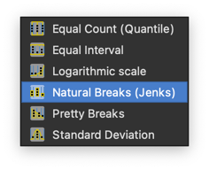

# Choropleth Maps
This page explains how to generate a choropleth map using QGIS.

## Prerequisites
 - Download [QGIS](https://qgis.org/en/site/) for free.
 - Download the [countries dataset](https://www.naturalearthdata.com/http//www.naturalearthdata.com/download/10m/cultural/ne_10m_admin_0_countries.zip). No need to decompress the file.

## Steps
1. Open QGIS and drag-and-drop the downloaded file on it. Choose the `.shp` file from the list of files.

2. Double-click on the layer name in the Layers list. From the "Properties" dialog, choose the "Symbology" tab on the left.

3. From the drop-down menu at the top, choose "Graduated".

4. Choose the attribute you want to color by. In this example, choose `POP_EST` which indicates the estimated population.

5. Click the `Classify` button to create the classes.

6. Click `OK` to close the window and apply the changes.

7. To explore a different way of creating classes, go back to the `Layer Properties` dialog and change the mode to `Natural Breaks (Jenks)` and increase the number of classes to 7.

8. The output will now look as follows. Notice the different ranges on the left.
